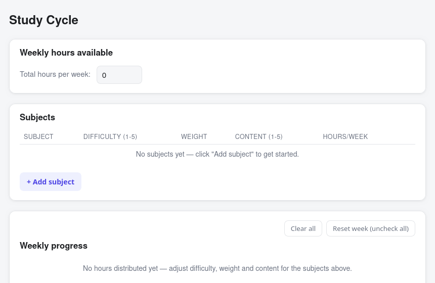

# Study Cycle



A lightweight desktop app (Windows, Linux, macOS) that plans a weekly study cycle. You add subjects, set how many hours you have available per week, and the app distributes those hours across subjects automatically. Each subject gets a row of small squares (one per hour) that you can check off manually as you study.

Ported from a single-file HTML prototype into a native app with [Tauri](https://tauri.app), so it ships as a small, fast executable instead of a browser tab: no bundled Chromium, no backend server.

## How the calculation works

For each subject:

```
rawWeight = (Difficulty + Content) × Weight
factor1   = sum of rawWeight across all subjects
factor3   = weekly hours available ÷ factor1
raw hours for the subject = rawWeight × factor3   (a fraction, e.g. 12.6h)
```

Flooring every subject's raw hours independently would lose the fractional part of each one, so the total could end up several hours short of the weekly target. Instead, hours are assigned with the "largest remainder" method (the same idea used to apportion seats in elections): every subject is floored first, then the few hours still missing are handed out, one each, to the subjects with the largest fractional remainder. The total always matches the weekly hours you entered exactly (for a whole-number target), and never exceeds it.

## Features

- Add/edit/remove subjects with Difficulty (1-5), Weight (any number ≥ 0) and Content (1-5)
- Automatic distribution of weekly hours across subjects
- Progress squares (one per hour) that you click to check/uncheck
- "Reset week" clears the checked squares; "Clear all" wipes subjects/hours back to a blank slate
- Everything is saved locally (no account, no server, no internet connection required)

## Stack

- [Tauri 2](https://tauri.app) (Rust + the OS's native webview: WebView2 on Windows, WKWebView on macOS, WebKitGTK on Linux)
- Plain HTML/CSS/JS frontend, no framework, no build step
- State persisted with `localStorage` inside the app's webview

## Running in development

Requires [Rust](https://www.rust-lang.org/tools/install) and [Node.js](https://nodejs.org).

```bash
npm install
npm run tauri dev
```

Linux also needs the WebKitGTK/GTK3 development packages (e.g. on Debian/Ubuntu: `webkit2gtk-4.1`, `libgtk-3-dev`; on Arch/Manjaro: `webkit2gtk-4.1`, `gtk3`). See the [Tauri prerequisites guide](https://v2.tauri.app/start/prerequisites/) for your OS.

## Building the app

```bash
npm run tauri build
```

This produces a native installer/bundle for the OS you run it on:

| Host OS | Output |
|---|---|
| Linux | `.deb`, `.rpm`, and `.AppImage` in `src-tauri/target/release/bundle/` |
| Windows | `.msi` and `.exe` (NSIS) installers |
| macOS | `.app` and `.dmg` |

Tauri does not meaningfully cross-compile GUI bundles between operating systems. To get all three installers, you build on (or via CI for) each target OS. The included [`.github/workflows/build.yml`](.github/workflows/build.yml) does this automatically: pushing a tag builds and attaches the Windows, Linux and macOS bundles to a GitHub Release.

> Note: building the `.AppImage` locally requires FUSE (`fusermount`); on some systems the bundled `linuxdeploy` tool's `strip` binary is also too old to handle ELF binaries produced by very new toolchains (fails on the `.relr.dyn` section). If that happens, the `.deb`/`.rpm` bundles still build fine, and CI (which uses a standard Ubuntu runner) builds the `.AppImage` without issue.

## Project structure

```
src/                 Frontend (HTML/CSS/JS), also used directly as the Tauri window content
src-tauri/           Rust shell, Tauri config, and app icons
assets/              Images used in this README
.github/workflows/   CI that builds installers for all three platforms
```
